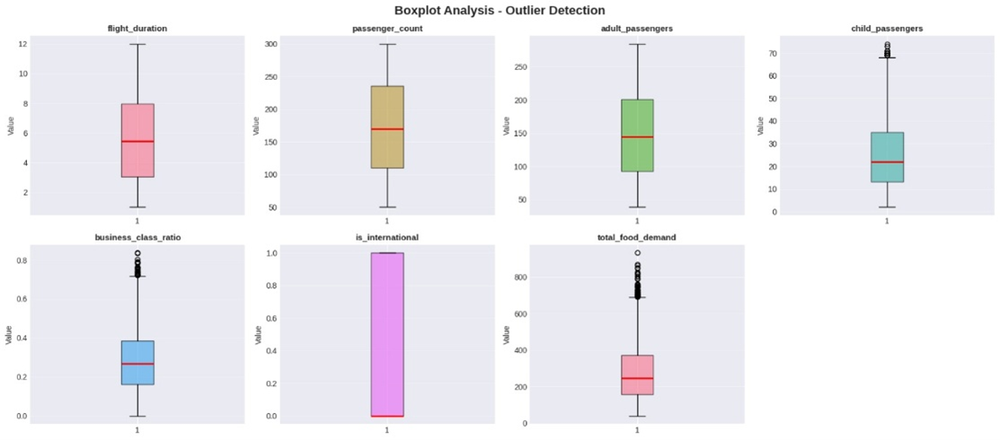
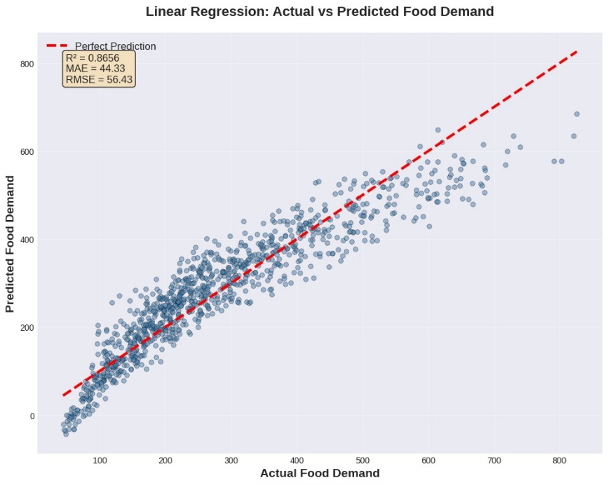
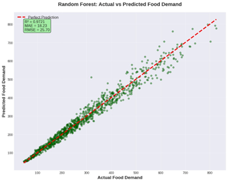
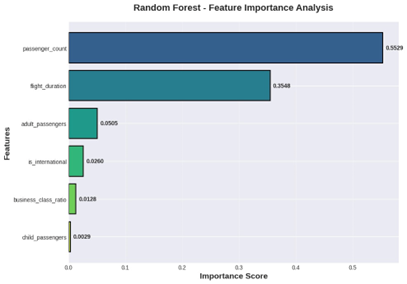

# Predicting Airline Food Demand Using Machine Learning

This project focuses on forecasting **in-flight food demand** to support airline catering
operations in minimizing **food waste** and preventing **stock-outs**.
The problem is modeled as a **supervised regression task** with a strong business focus.

---

## 🎯 Problem Statement
Airline catering decisions directly affect:
- Operational costs
- Food waste and sustainability
- Passenger satisfaction

Over-catering increases waste and fuel cost due to extra weight,
while under-catering causes service failures.
Static rules (e.g., loading a fixed percentage of passengers) fail to capture
flight-specific dynamics.

---

## 📦 Dataset
A **synthetic dataset (5,000 flights)** was generated to simulate real airline operations.

### Features
- Flight duration (hours)
- Passenger count
- Adult & child passenger distribution
- Business class ratio
- Domestic / international indicator

**Target variable:** total food demand per flight

The dataset respects realistic constraints such as:
- Passenger composition consistency
- Minimum duration for international flights
- Nonlinear demand behavior

---

## 🔍 Exploratory Data Analysis

### Target Distribution

### Feature Boxplots

### Correlation Heatmap

EDA shows that food demand is influenced by multiple interacting factors
and cannot be captured by a simple linear relationship.

---

## 🧠 Modeling Approach
The following models were evaluated:

- **Baseline (Mean Predictor)**
- **Linear Regression**
- **Random Forest Regression**
- Hyperparameter tuning with **GridSearchCV** (Random Forest)

---

## 📈 Model Performance

### Linear Regression – Actual vs Predicted

### Random Forest – Actual vs Predicted

### Model Comparison

**Random Forest significantly outperforms Linear Regression**, capturing nonlinear
patterns and interactions between features.

---

## 🌲 Feature Importance (Random Forest)

Passenger count and flight duration emerge as the most influential features,
with additional impact from passenger composition and flight type.

---

## 💰 Business Cost Analysis
An asymmetric cost function was applied:
- Over-prediction (waste): **$5 per unit**
- Under-prediction (stock-out): **$20 per unit**

Under this setup, the Random Forest model achieves an estimated
**60–70% reduction in operational cost** compared to Linear Regression.

---

## 🛠 Tech Stack
- Python
- pandas, numpy
- matplotlib
- scikit-learn

---

## 📁 Repository Structure
- `notebooks/` → EDA, modeling, evaluation
- `data/` → synthetic dataset
- `images/` → visual outputs
- `report/` → final project report

---

## 📄 Report
Full project report is available at:
`report/final_project_report.pdf`
